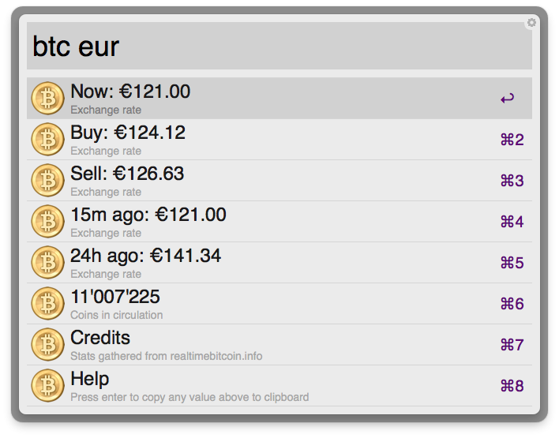

# BitcoinStats

> BitcoinStats in an Alfred 2 workflow that displays statistics from [realtimebitcoin.info](http://realtimebitcoin.info).

## Installation

1. [Download the workflow](https://raw.github.com/romac/Alfred-BitcoinStats/master/Bitcoin%20Stats.alfredworkflow).
2. Double-click on it.
3. Follow the instructions below.

## Usage

Type `btc` in Alfred, optionally followed by a currency.
You may change the default currency by editing the Script Filter and setting `$DEFAULT_CURRENCY` to any of the following available currencies:
	USD, CNY, JPY, SGD, HKD, CAD, AUD, NZD, GBP, DKK, SEK, BRL, CHF, EUR, RUB, SLL, PLN, THB

Select any item to copy its value to the clipboard.

You can hide the Credits and Help items by editing the Script Filter and setting `$SHOW_CREDITS` and `$SHOW_HELP` to false.

## Screenshot

.

## Credits

Bitcoin statistics are gathered from [realtimebitcoin.info](http://realtimebitcoin.info), with the permission from its author.

Bitcoin icon from [https://en.bitcoin.it/wiki/Promotional_graphics]().

## License

Copyright © 2013 Romain Ruetschi (romain.ruetschi@gmail.com)

BitcoinStats is released under the [MIT license](http://romac.mit-license.org).